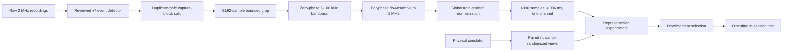
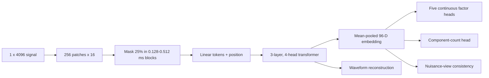

# Physics-Informed Yeast Signal Representation: Complete Study Report

**Study status:** complete controlled negative result under the restricted
single-acquisition scope accepted on 2026-07-15

**Protocol:** `yeast-ssl-rebuild-v1`

**Decision:** do not promote A4; stop architecture search under this protocol

This document is the central scientific and pedagogical account of the rebuilt
yeast representation study. The original critique and preregistered decisions
remain in [`YEAST_SSL_CRITIQUE_AND_REBUILD_PLAN.md`](YEAST_SSL_CRITIQUE_AND_REBUILD_PLAN.md).
The chronological infrastructure record is in
[`YEAST_SSL_EXECUTION_LOG.md`](YEAST_SSL_EXECUTION_LOG.md).
The separately preregistered one-month follow-up is in
[`YEAST_SSL_ONE_MONTH_FOLLOWUP_PLAN_2026-07-16.md`](YEAST_SSL_ONE_MONTH_FOLLOWUP_PLAN_2026-07-16.md);
it does not reopen this protocol or its final test. The later, development-only
diagnosis of the failed SSL objective is recorded in
[`YEAST_SSL_OBJECTIVE_RESCUE_LOG_2026-07-17.md`](YEAST_SSL_OBJECTIVE_RESCUE_LOG_2026-07-17.md).

## Abstract

We tested whether a compact transformer representation learned from physical
simulations and scarce unlabeled real yeast signals could improve a frozen
linear probe when only 10% of development labels were available. A reviewed
signal-processing detector produced 8,721 event crops from one acquisition.
The comparison included raw, handcrafted, random, supervised Conv1D, MOMENT,
PatchTST, real-only self-supervision (A1), synthetic reconstruction (A2),
physics-informed synthetic pretraining (A3), and A3 followed by real
self-supervised adaptation (A4). All custom cells used one architecture and
three representation seeds; probes used three paired seeds.

Physics supervision had a measurable effect: A3 exceeded A2 by `0.0457`
development macro F1, and A4 exceeded A3 by `0.0160`. A4 also improved recovery
of every retained simulated factor. These gains did not make the representation
the best practical system. On development, A4 (`0.3505`) did not improve over
handcrafted features (`0.3561`). On the one-time in-session test, A4 reached
`0.3529` versus `0.4334` for handcrafted features, a paired difference of
`-0.0805` with a 95% hierarchical bootstrap interval `[-0.1040, -0.0484]`.
The simulation-real domain remained almost perfectly separable, the embeddings
were highly anisotropic, and the weakest source-condition proxy, `shmoo`, had
only `0.148` recall with A4.

The scientifically defensible conclusion is therefore narrow: the proposed
physics-informed plus real-adaptation recipe learns some intended simulated
factors and improves its synthetic-only predecessor, but does not outperform a
strong signal-processing representation for the available in-session proxy
task. The study does not evaluate morphology or cross-acquisition transfer.

## 1. Claim Boundary

The four source folders (`budding`, `mix`, `shmoo`, and `shmoo2`) are
acquisition-condition groups. They are used as **source-condition proxies**, not
independently annotated yeast morphologies. All real recordings come from one
documented acquisition configuration. Consequently:

- this is an in-session representation comparison;
- it is not a morphology-classification result;
- it is not an acquisition-OOD or biological generalization result;
- it does not establish that transformers are generally better or worse than
  CNNs;
- it does not compare full-trace detection pipelines in P1 and P2.

A second acquisition and independent reviewer reliability were unavailable.
The project owner explicitly waived them as execution requirements because no
more yeast material could be acquired. The limitations were not reclassified as
passed evidence. See
[`YEAST_SSL_SCOPE_DECISION_2026-07-15.md`](YEAST_SSL_SCOPE_DECISION_2026-07-15.md).

## 2. Research Question and Hypotheses

The operational question became:

> Does physics-informed synthetic pretraining followed by self-supervised
> adaptation on unlabeled real event signals improve label-efficient frozen
> representations over strong baselines?

The primary endpoint was macro F1 from a frozen encoder and linear probe using
10% of development-training proxy labels. The minimum relevant improvement was
fixed at `0.03` macro F1. The causal questions within the custom architecture
were:

| Contrast | Question |
|---|---|
| A3 - A2 | Does physical supervision add value beyond synthetic reconstruction? |
| A4 - A3 | Does unlabeled real adaptation add value after physical pretraining? |
| A4 - strongest baseline | Is the complete recipe practically preferable? |

Reconstruction, retained-factor recovery, robustness, retrieval, collapse, and
domain separability were mechanism diagnostics. They could explain a result,
but could not override the primary endpoint.

## 3. Data and Event Extraction

The immutable raw dataset contains 6,172 `float64[16384]` signals. A duplicate
audit found 449 exact pairs; splitting was performed by duplicate-safe
32-record capture blocks before event extraction. The final representation
dataset contains 8,721 events and is registered as
`yeast-events-representation@v3`.

The revised v7 detector was reviewed before representation training:

| Detector result | Estimate | Wilson 95% interval |
|---|---:|---:|
| Retained candidate precision | 48/48 = 1.000 | [0.926, 1.000] |
| Full-trace precision | 85/86 = 0.988 | [0.937, 0.998] |
| Full-trace recall | 85/86 = 0.988 | [0.937, 0.998] |
| Rejected windows containing an event | 6/40 = 0.150 | [0.071, 0.291] |

These numbers validate extraction only for the inspected acquisition. One
reviewer performed the review. A visible event outside a proposed interval did
not make that interval a true positive; missed events were counted at the
full-trace level.



### Frozen input contract

Every custom method receives one real-valued channel of 4,096 samples at
1 MHz, covering 4.096 ms. It is produced from an 8,192-sample bounded crop,
fixed filtering, anti-aliased downsampling, and development-training global
normalization. Absolute amplitude is unresolved; small position changes, phase,
noise, drift, and sensor response are nuisances.

This is **multi-view**, not multimodal or multichannel, learning. Paired
synthetic views share retained physical factors while nuisance variables are
resampled. Calling them modalities would overstate the data: both are versions
of the same one-channel signal.

## 4. Representation Method

### Encoder architecture

The custom model is a compact patch transformer with 349,367 trainable
parameters, including a 338,992-parameter reconstructor:

- 4,096 input samples;
- 256 non-overlapping patches of 16 samples (`16 us`);
- linear projection to `d_model=96`;
- three pre-norm transformer encoder layers;
- four attention heads and a 384-unit feed-forward layer;
- sinusoidal positions and mean token pooling;
- waveform reconstruction, five-factor regression, and component-count heads.



The 25% mask uses contiguous physical-time blocks with a `0.016 ms` guard. It
therefore asks for contextual reconstruction rather than isolated-sample
imputation. For every seed, learned reconstruction beat linear interpolation.
A retrospective development-only audit on 2026-07-17 added the missing zero
and visible-mean controls. A1 was marginally worse than zero for all three
seeds, and its output RMS was only `0.7-0.9%` of target RMS. Linear
interpolation was therefore an insufficient control for these oscillatory
gaps: A1 reached the near-zero conditional-mean solution and did not validate
the pretext task. The reproducible audit is
`artifacts/unsupervised-learning-flow-cytometry/audits/yeast-a1-reconstruction-controls-v1`.

### Loss and supervision

The combined training loss was:

```text
L = 1.00 L_reconstruction
  + 0.25 L_retained_continuous_factors
  + 0.10 L_component_count
  + 0.10 L_nuisance_view_consistency
```

Masked reconstruction is self-supervised. The factor and component targets are
known simulator latents and are therefore physics-supervised. The linear probe
is supervised downstream evaluation. Keeping these terms separate is essential:
using an unlabeled real dataset does not make the full method purely
self-supervised.

### Experimental cells

| Cell | Synthetic stage | Real stage | Interpretation |
|---|---|---|---|
| A0 | None | None | Frozen raw, handcrafted, public, random, and supervised baselines |
| A1 | None | 20 epochs masked SSL | Can scarce real-only SSL work from scratch? |
| A2 | 20 epochs reconstruction | None | Synthetic reconstruction control |
| A3 | 20 epochs physics + reconstruction | None | Contribution of physical supervision |
| A4 | A3 initialization | 10 adaptation epochs | Complete method with 30% to 10% synthetic replay |

All A1-A4 cells used AdamW, learning rate `3e-4`, batch size 32, identical
architecture, and representation seeds 42, 43, and 44. No architecture search
was performed after seeing results.

### Baselines and comparability

RMS, raw samples, handcrafted time-frequency features, a random encoder,
official frozen MOMENT, frozen PatchTST, and a supervised Conv1D were evaluated.
These are fair **system baselines** under the same input and split, but not a
causal architecture experiment: model size, external pretraining, objective,
and label access differ. Only A1-A4 contrasts hold the custom architecture and
budget sufficiently fixed to support causal interpretation.

## 5. Evaluation and Statistics

Development labels were sampled at 1%, 5%, 10%, 25%, and 100%. Encoders were
frozen and the same logistic linear-probe implementation was used. Three probe
seeds were paired across methods; A1-A4 additionally used three representation
seeds, yielding nine probe/representation combinations per cell.

Uncertainty used 1,000 hierarchical paired bootstrap repetitions over both
representation/probe runs and capture blocks. Logistic fits were rerun with a
5,000-iteration limit and explicit convergence instrumentation: 204/204 fits
converged, with maximum 551 iterations and no convergence warning. Relative to
the original 500-iteration evaluation, 12/180 macro-F1 rows changed by at most
`0.002782`; every 10% paired conclusion was unchanged.

The final protocol was frozen before opening `in_session_test`. Only the
strongest baseline (handcrafted), A3, and A4 were evaluated at 10%. Probe
training still used only `development_train`; 877 test events in 20 disjoint
capture blocks were used only for evaluation.

### Pedagogical definitions

**Linear probe.** A simple classifier trained on frozen embeddings. It tests
whether information is readily accessible without allowing the encoder to
adapt to labels.

**Effective rank.** A spectrum-based estimate of how many embedding directions
carry substantial variance. An effective rank near 1 in a 96-dimensional space
means most samples lie near a line, a warning of representation collapse or
strong anisotropy.

**Domain probe.** A classifier predicting simulated versus real origin from an
embedding. A high ROC AUC means domain identity remains easy to recover. It does
not prove which domain difference is a nuisance, but it refutes a claim that the
domains have been aligned.

**Hierarchical bootstrap.** Resampling at more than one uncertainty level. Here
it resamples representation/probe runs and acquisition capture blocks, avoiding
the false precision that would result from treating correlated events as fully
independent.

## 6. Development Results

At the primary 10% label fraction:

| Method | Macro F1, mean +/- SD | Runs |
|---|---:|---:|
| RMS | 0.1739 +/- 0.0257 | 3 |
| Raw signal | 0.2590 +/- 0.0108 | 3 |
| Handcrafted | **0.3561 +/- 0.0128** | 3 |
| Random encoder | 0.3015 +/- 0.0269 | 3 |
| MOMENT | 0.3287 +/- 0.0135 | 3 |
| PatchTST | 0.2868 +/- 0.0006 | 3 |
| Supervised Conv1D | 0.2618 +/- 0.0562 | 3 |
| A1 real SSL | 0.2941 +/- 0.0247 | 9 |
| A2 synthetic reconstruction | 0.2888 +/- 0.0144 | 9 |
| A3 physics-informed | 0.3345 +/- 0.0263 | 9 |
| A4 physics + adaptation | 0.3505 +/- 0.0260 | 9 |


*Figure 1. Development macro F1 across frozen label fractions. Curves quantify
label efficiency; they do not establish morphology or OOD transfer.*

The normalized label-efficiency AUC was 0.3765 for handcrafted features, 0.3677
for MOMENT, 0.3720 for A4, and 0.3479 for A3. A4 was competitive, but did not
displace the simpler handcrafted system.

| Paired development contrast | Difference | 95% interval |
|---|---:|---:|
| A4 - handcrafted | -0.0056 | [-0.0260, 0.0124] |
| A4 - MOMENT | +0.0219 | [-0.0129, 0.0371] |
| A4 - A3 | +0.0160 | [0.0008, 0.0281] |
| A3 - A2 | +0.0457 | [0.0230, 0.0584] |


*Figure 2. Hierarchical paired development contrasts at 10% labels. The A4 gain
over A3 is small and below the preregistered 0.03 practical effect.*

## 7. What the Representation Learned

### Physics supervision worked on its intended synthetic factors

A3 improved over A2, and A4 improved mean held-out recovery over A2 for all five
continuous retained factors. Mean relative MSE reductions for A2 versus A4 were:

| Factor | A2 | A4 |
|---|---:|---:|
| Doppler | 0.861 | 0.960 |
| Duration | 0.644 | 0.888 |
| Component separation | 0.033 | 0.047 |
| Frequency separation | 0.014 | 0.143 |
| Relative component amplitude | -0.002 | 0.258 |

Component-count balanced accuracy rose from about 0.56 for A2 to about 0.90 for
A4. Thus the physical heads were not redundant. However, component separation
remained weak, and synthetic-factor recovery did not guarantee real proxy
discrimination.


*Figure 3. Held-out synthetic retained-factor recovery. Positive values indicate
improvement over a constant-target prior.*

### Real adaptation did not align the domains

Simulation-real ROC AUC was `0.9796-0.9904` for A1, `0.9799-0.9869` for A2,
`0.9990-0.9994` for A3, and `0.9995-0.9998` for A4. Real adaptation slightly
increased, rather than reduced, separability. This does not prove all domain
information is harmful, but it shows that A4 did not achieve domain invariance.


*Figure 4. Domain separability plotted against retained-factor recovery. A4
improves physical recovery while leaving an extreme domain gap.*

### Embedding geometry remained unhealthy

A1 and A2 had effective ranks of only about 1.2-1.7 out of 96 and mean pairwise
cosine similarities near 0.99999. A3 and A4 improved to roughly 2.7-4.2, but
remained highly anisotropic with cosine similarities around 0.973-0.990. The
model therefore avoided literal constant output while using only a small part
of its nominal embedding dimension.


*Figure 5. Effective rank and cosine concentration. Downstream gains coexist
with severe dimensional concentration.*

### Robustness and retrieval exposed shortcuts

A4 mean prediction agreement under bounded perturbations was about 0.875, but
the worst perturbation fell to about 0.570. Small shifts and center masks remain
important sensitivities. More critically, cross-recording retrieval purity for
quality stratum was 1.0 for every checkpoint. The embedding strongly encodes
detector quality, which can dominate apparent neighborhood structure.


*Figure 6. Prediction agreement under preregistered bounded perturbations.*


*Figure 7. Cross-recording retrieval diagnostics. Perfect quality purity is a
shortcut warning, not a biological success.*

## 8. One-Time In-Session Test

The sealed in-session split was opened once after development rejected A4
promotion. The test was confirmatory and could not reopen model selection.

| Method | Macro F1, mean +/- SD | Runs |
|---|---:|---:|
| Handcrafted | **0.4334 +/- 0.0261** | 3 |
| A3 physics-informed | 0.3293 +/- 0.0297 | 9 |
| A4 physics + adaptation | 0.3529 +/- 0.0228 | 9 |


*Figure 8. Frozen 10%-label in-session test endpoint. Error bars show run-level
standard deviation; paired intervals below provide the inferential comparison.*

A4 minus handcrafted was `-0.0805`, 95% interval
`[-0.1040, -0.0484]`, with bootstrap probability of a positive effect `0.000`.
A4 minus A3 was `+0.0235`, interval `[0.0060, 0.0403]`, probability positive
`0.999`; the mean remained below the 0.03 practical-effect threshold.


*Figure 9. Final hierarchical paired differences. The complete method improves
its predecessor but is decisively below handcrafted features.*

The failure is not uniform. A4 recall was 0.428 for `budding`, 0.552 for `mix`,
0.148 for `shmoo`, and 0.437 for `shmoo2`. Handcrafted recall was higher for
every proxy and especially for `shmoo` (0.374).


*Figure 10. Final recall by source-condition proxy. These rows are not
morphological classes.*

## 9. Failures, Corrections, and Consequences

| Observation | Interpretation | Consequence |
|---|---|---|
| Legacy 4096 paths represented different physical durations | Tensor shape alone was an invalid contract | Frozen one 4.096 ms input definition |
| Legacy simulator supervised variables also randomized as nuisances | The objective was internally contradictory | Rebuilt identifiable retained/nuisance policy |
| v5 detector had 44 false positives and rejected true wide events | SNR and width heuristics were insufficient | Reviewed, revised, and froze v7 |
| A1/A2 effective rank near 1 | Reconstruction can be solved with poor geometry | Collapse diagnostics became mandatory |
| A1 beat interpolation but not zero | Interpolation is a misleading baseline for long oscillatory gaps | Gate 4 retrospectively fails; zero and amplitude controls are mandatory |
| A3 improved A2 | Physics supervision carries intended information | Retain as a positive mechanism result |
| A4 improved A3 | Real adaptation contributes | Effect is real but too small for promotion |
| A4 did not reduce domain AUC | Adaptation did not bridge simulation to reality | Reject domain-alignment claim |
| Quality retrieval purity was 1.0 | Detector quality is a dominant shortcut | Reject biological interpretation of neighborhoods |
| A4 lost to handcrafted on final test | Added complexity is not justified for this endpoint | Do not promote; stop architecture search |

Two pfcalcul jobs initially failed before training because MOMENT attempted to
resolve redundant FLAN configuration and weights. The loader was corrected to
construct the architecture from configuration and load the official checkpoint
once. Later, linear probes reached the original 500-iteration cap; the corrected
5,000-iteration evaluation converged fully and did not change the decision.
These are infrastructure corrections, not additional model-selection rounds.

The immutable final metrics contain a historical key named
`primary_interval_excludes_zero`. Its `false` value meant "does not exclude zero
on the positive side". The actual interval is entirely below zero. The final
report records the unambiguous field `primary_interval_position =
entirely_below_zero`; the immutable source run was not rewritten.

## 10. Gate Decisions

| Gate | Final state | Reason |
|---|---|---|
| 0 provenance | Pass | Registered datasets, revisions, checksums, and manifests complete |
| 1 event/split validity | Conditional pass | v7 and split checks pass for one acquisition; reliability/OOD waived, not satisfied |
| 2 input/information contract | Pass | One physical contract and coherent factor policy enforced |
| 3 baselines | Pass | A0 system baselines complete over the frozen splits |
| 4 pretext validity | Original fail; bounded diagnosis closed negative | A1 is worse than zero; S1 later optimizes and avoids collapse but remains `2.34x` worse than interpolation |
| 5 scientific promotion | Fail / controlled negative | A4 fails the primary baseline and minimum-effect criteria |
| 6 optional expansion | Not authorized for A0-A4 | The final test remains closed; the separately frozen development-only objective diagnosis is complete |

## 11. Scientific Conclusion

The study separates **mechanistic success** from **practical success**.
Physics-informed targets improved simulated factor recovery, and real adaptation
improved A3 consistently. Those observations support the implementation and the
causal A2-A3-A4 logic. They do not support deploying A4 or claiming that it
learned a domain-general yeast representation. The handcrafted baseline remains
the appropriate representation for the restricted source-proxy endpoint.

The controlled negative result is useful: the tested scarce real-only masked-MSE SSL failed;
synthetic reconstruction alone was weak and nearly collapsed; physical
supervision repaired part of the geometry; real adaptation added a small gain;
but neither repaired the simulation-real gap nor the class-specific failure.
More optimization of the same one-acquisition protocol would be architecture
search against an exhausted endpoint, not stronger evidence.

### Post-study diagnosis of the SSL loss

A separate development-only rescue asked a narrower question: did A1 fail
because the implementation could not optimize, because its embeddings
collapsed, or because the prediction target was not informative enough? This
work never reopened the one-time test.

Patch-aligned masks first repaired waveform reconstruction. A matched two-view
VICReg cell then raised effective rank from `2.55` to `9.60`, but failed linear
utility against C0, random, and handcrafted controls. The final S1
objective/head package replaced pointwise waveform prediction with local
analytic log-power while preserving the encoder, PE25 masks, optimizer,
20-epoch budget, data order, and VICReg weight.

S1's prediction loss fell by `73.7%`, its output reached `0.940` of target RMS,
effective rank reached `14.82`, and mean pairwise cosine fell to `0.698`.
Therefore the original concern that the SSL loss could not go down is no longer
correct. Nevertheless, S1 development-validation MSE was `0.0597`, versus
`0.0255` for computing the same features after linear waveform interpolation.
The failure held separately on event, boundary, and background frames. S1 thus
learned a noncollapsed representation and a real pretext, but did not add
predictive information beyond a simple deterministic signal-processing rule.


*Figure 11. The S1 loss optimizes and embedding geometry improves, but the
strong interpolation control remains better in every region.*

The frozen decision was `end_objective_rescue_negative`: no S1 utility, extra
representation seed, new target sweep, simulation-assisted rescue, or sealed
evaluation was authorized. Because target choice and validation gates were
developed on the same development regime, this is an exploratory stop decision
for this objective/head package, not a universal negative claim about spectral
SSL.

## 12. Limitations and Future Study

The current study can be frozen. A scientifically distinct follow-up requires
new information, not another seed or hidden-size sweep:

1. acquire at least one independent session with acquisition metadata;
2. obtain independent event review or blinded repeatability evidence;
3. annotate actual morphology if morphology is the intended downstream claim;
4. redesign the simulator from measured domain discrepancies and test held-out
   generator variants;
5. consider explicit domain alignment only with safeguards that preserve
   retained factors and avoid collapse;
6. preregister the new endpoint before opening its held-out acquisition.

Without these additions, the appropriate action is documentation and
publication integration, not further model tuning.

## 13. Reproducibility and Evidence

| Item | Identity |
|---|---|
| Data owner revision | `particles2SNR-pipeline@b5bebb895126af6fc880854ba97d98a6ceab0b0a` |
| Final evaluation revision | `unsupervised-learning-flow-cytometry@a20ec528fc3c632a8ef3856be6942a47399ccdd0` |
| Final report-code revision | `unsupervised-learning-flow-cytometry@23945b00cef75b14acc8703dc026a3a4ce264d27` |
| Full pfcalcul training | Slurm `23487036`, 59 min 51 s |
| Converged corrective evaluation | Slurm `23487071`, 6 min 30 s |
| One-time final evaluation | Slurm `23487080`, 52 s |
| Final metrics SHA256 | `0f0b993b79552729790c9b9be71dfc2d5d13811dd84015060cb52753fed2faae` |
| Final predictions SHA256 | `84221ba21687bddc4eda1cc2e5c68e723d785e143b27fe74e6ec5df00afaa8eb` |
| S1 training revision | `unsupervised-learning-flow-cytometry@4bc2403919c34bf3c6c192c72115b030d9a407f6` |
| S1 report revision | `unsupervised-learning-flow-cytometry@5e0e863` |
| S1 dataset manifest | `06ba5d041f4d5bf6e5574d134fee955fd9546d6a3e7532ae1d1456fee274fe5a` |

Canonical artifacts from the workspace root:

- development report:
  `artifacts/unsupervised-learning-flow-cytometry/reports/yeast-pfcalcul-full-v3-publication/`;
- final source metrics and predictions:
  `artifacts/unsupervised-learning-flow-cytometry/runs/yeast-pfcalcul-final-in-session-v1/`;
- final rendered report:
  `artifacts/unsupervised-learning-flow-cytometry/reports/yeast-pfcalcul-final-in-session-v1/`;
- detector review:
  `artifacts/particles2SNR-pipeline/audits/yeast-event-review-v7-analysis-20260715-v2/`.
- terminal S1 objective decision:
  `artifacts/unsupervised-learning-flow-cytometry/reports/yeast-local-spectral-decision-v1/`.

Validation from the workspace root:

```bash
.venv/bin/workspace artifacts validate \
  artifacts/unsupervised-learning-flow-cytometry/reports/yeast-pfcalcul-final-in-session-v1
.venv/bin/python -m pytest -q unsupervised-learning-flow-cytometry/tests
.venv/bin/workspace doctor
```

The one-time final evaluator rejects an existing completed final opening. Do not
rerun it under a new ID on the same sealed split.
