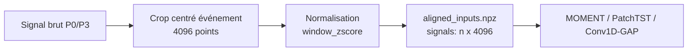

# Pipeline P3 Canonique 4096

> **Historical implementation notice (updated 2026-07-15).** This document
> predates the completed rebuilt study. Its `window_zscore` and decimated-4096
> descriptions are not the frozen `yeast-ssl-rebuild-v1` contract. The final
> contract is a filtered, anti-aliased, globally normalized 4.096 ms event crop;
> see
> [`YEAST_SSL_REBUILT_STUDY_REPORT.md`](YEAST_SSL_REBUILT_STUDY_REPORT.md).
> Retain the material below only for legacy implementation context.

Cette note fixe l'état cible actuel de P3 : les datasets événementiels, les
sweeps synthétiques et les comparaisons de latent spaces utilisent des entrées
1D de `4096` points normalisées par `window_zscore`. Les anciens artefacts en
`512` restent lisibles pour comparaison historique, mais ils ne sont plus la
représentation de référence.

## Représentation Canonique



Règles actuelles :

- fichier d'entrée modèle : `aligned_inputs.npz` ;
- clé signal : `signals` ;
- shape attendue : `(n_events, 4096)` ;
- nom legacy accepté en lecture : `aligned_512_inputs.npz` ;
- un mélange particles `512` + yeast `4096` doit être rejeté explicitement.

Le `512` existe encore dans deux cas seulement :

- paramètres internes de modèles externes ou STFT, par exemple `stft_nperseg=512` ;
- compatibilité avec anciens outputs, via fallback de lecture legacy.

## Datasets Réels

Yeast :

```bash
HF_HUB_OFFLINE=1 TRANSFORMERS_OFFLINE=1 MPLCONFIGDIR=/tmp/matplotlib-cache \
../.venv/bin/python scripts/build_yeast_event_dataset.py \
  --input-dir /home/intern/Downloads/Yeast_folder \
  --output-dir artifacts/unsupervised-learning-flow-cytometry/pretrained_backbones-4096_YYYYMMDD/yeast_passage_events_p3_4096 \
  --quality strict \
  --write-audit
```

Particles2SNR_F 3 classes avec MOMENT, PatchTST et Conv1D-GAP même entrée :

```bash
HF_HUB_OFFLINE=1 TRANSFORMERS_OFFLINE=1 MPLCONFIGDIR=/tmp/matplotlib-cache \
../.venv/bin/python scripts/run_particles2snr_f_3class_aligned_backbones.py \
  --output-dir artifacts/unsupervised-learning-flow-cytometry/pretrained_backbones-4096_YYYYMMDD/particles2snr_f_3class_moment_patchtst_conv1dgap \
  --input-length 4096 \
  --raw-crop-length 4096 \
  --device cuda
```

Le script écrit :

- `aligned_inputs.npz` ;
- `events_metadata.csv` ;
- `visual_events_metadata.csv` ;
- `run_config.json` ;
- sous-dossiers modèle avec embeddings, métriques et figures.

Pour un smoke rapide, limiter le dataset :

```bash
../.venv/bin/python scripts/run_particles2snr_f_3class_aligned_backbones.py \
  --output-dir artifacts/unsupervised-learning-flow-cytometry/pretrained_backbones-4096_YYYYMMDD/particles_quick \
  --input-length 4096 \
  --raw-crop-length 4096 \
  --max-events-per-class 20 \
  --max-plot-per-class 20 \
  --conv-epochs 3 \
  --device cuda
```

## Yeast + Particles

Le combineur encode les yeast avec les mêmes modèles et réutilise les embeddings
particles déjà produits. Les deux bundles doivent avoir la même longueur.

```bash
HF_HUB_OFFLINE=1 TRANSFORMERS_OFFLINE=1 MPLCONFIGDIR=/tmp/matplotlib-cache \
../.venv/bin/python scripts/run_particles2snr_f_plus_yeast_embeddings.py \
  --particle-root artifacts/unsupervised-learning-flow-cytometry/pretrained_backbones-4096_YYYYMMDD/particles2snr_f_3class_moment_patchtst_conv1dgap \
  --yeast-root artifacts/unsupervised-learning-flow-cytometry/pretrained_backbones-4096_YYYYMMDD/yeast_passage_events_p3_4096 \
  --output-dir artifacts/unsupervised-learning-flow-cytometry/pretrained_backbones-4096_YYYYMMDD/particles2snr_f_3class_plus_yeast \
  --input-length 4096 \
  --device cuda
```

Pour un smoke, utiliser `--max-yeast-events`.

## Sweeps Synthétiques

Les latent sweeps analytiques utilisent maintenant `4096` par défaut. Le launcher
principal est :

```bash
HF_HUB_OFFLINE=1 TRANSFORMERS_OFFLINE=1 MPLCONFIGDIR=/tmp/matplotlib-cache \
bash scripts/launch_particle_equation_latent_sweeps.sh
```

Pour un appel direct :

```bash
../.venv/bin/python scripts/run_particle_equation_latent_sweeps.py \
  --scenario single_particle \
  --models moment_official,patchtst_pretrained,conv1dgap_same_input_3class \
  --input-length 4096 \
  --single-sweep-source paper_table \
  --signal-window-duration-ms 1.0 \
  --realistic-figure-based-sweeps
```

## GPU Et Sandbox

Depuis Codex, le sandbox par défaut ne voit pas forcément `/dev/nvidia*`. Dans
ce cas, `nvidia-smi` échoue et PyTorch retourne `torch.cuda.is_available() ==
False`, même si le GPU fonctionne sur la machine.

Diagnostic :

```bash
../.venv/bin/python scripts/check_gpu_access.py
```

Pour les runs GPU lancés par Codex, utiliser une exécution hors sandbox /
escaladée. Un état sain montre à la fois :

- `nvidia-smi -L` avec le GPU ;
- `torch_cuda_available: true` ;
- au moins un device PyTorch.

## Comparaison Avec Les Runs 512

Les anciens dossiers utiles pour comparaison historique sont typiquement sous :

```text
artifacts/unsupervised-learning-flow-cytometry/pretrained_backbones-10dB/
```

Ils utilisent généralement :

```text
center crop raw 4096 -> mean decimate by 8 -> 512 -> window_zscore
```

Ne pas mélanger leurs `aligned_512_inputs.npz` avec les nouveaux
`aligned_inputs.npz` dans une même comparaison, sauf si le script annonce
explicitement une compatibilité legacy et vérifie les longueurs.

## Artefacts Déjà Régénérés

Au 1er juillet 2026, les artefacts 4096 disponibles sont :

```text
artifacts/unsupervised-learning-flow-cytometry/pretrained_backbones-4096_20260701/yeast_passage_events_p3_4096/
artifacts/unsupervised-learning-flow-cytometry/pretrained_backbones-4096_20260701/particles2snr_f_3class_moment_patchtst_conv1dgap_quick_offline/
artifacts/unsupervised-learning-flow-cytometry/pretrained_backbones-4096_20260701/particles2snr_f_3class_plus_yeast_quick_offline/
```

Le full-dataset 4096 a été testé sur GPU et le GPU est bien accessible hors
sandbox, mais les runs longs Conv1D-GAP 4096 ont été interrompus avant écriture
du checkpoint final car ils dépassaient la durée raisonnable d'un tour
interactif. Pour une comparaison finale avec les runs 512, relancer le full
hors sandbox avec `--device cuda`.
