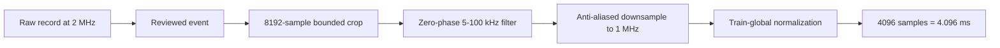

# Yeast SSL, Explained Step by Step

**A guided companion to the supervisor presentation**
**Audience:** someone who knows deep learning, but did not follow this project
**Status:** scientific communication document; it does not reopen any frozen test

## The project in one paragraph

We have one-dimensional optical signals recorded when yeast-related events pass
through a sensing region. Labels are scarce and imperfect. The broad idea was
therefore to learn a useful signal representation without relying entirely on
labels. We first tried masked reconstruction, then inspected what pretrained
encoders and simulated physical sweeps placed in their latent spaces. We later
added simulation-based physical supervision and adaptation on unlabeled real
signals. The final controlled model learned several intended simulated factors
and improved over its own synthetic-only version, but it did not beat a strong
handcrafted signal-processing baseline. Follow-up experiments showed that the
remaining bottleneck is not obviously the Transformer architecture: it is the
meaning of the available labels and the validity of the simulation-to-real
bridge.

> **Short conclusion:** the representation learned something real about our
> simulator, but not enough of the useful structure of the measured data to
> replace carefully designed signal features.

## How to read this document

For every experiment, ask six questions:

1. What problem were we trying to solve?
2. Why did the proposed idea seem reasonable?
3. What theory or equation supports the idea?
4. What exactly did we compare?
5. What did the result prove, and what did it not prove?
6. Why did that result lead to the next experiment?

This matters because the project did not follow one perfect plan from the
beginning. It was a sequence of hypotheses. Some were useful, some were
incomplete, and one was logically contradictory. The scientific value comes
from showing how each result changed the next question.


## Essential vocabulary

| Term | Meaning here |
|---|---|
| **Event** | A bounded part of a full trace that the detector identifies as containing a particle/yeast-related signal. |
| **Encoder** | A neural network that maps a waveform `x` to a compact vector `z`. |
| **Representation / latent / embedding** | The vector `z`. It is useful if relevant information is easy to recover from it and nuisance variation is controlled. |
| **Self-supervised learning (SSL)** | Training where targets are created from the input itself, for example reconstructing a masked region. |
| **Physics supervision** | Training against known parameters from a simulator. It does not require manual labels, but it is still supervision. |
| **Linear probe** | Freeze the encoder, then train a simple linear classifier on `z`. This asks whether task information is already accessible. |
| **Nuisance** | A variable that may change without changing the physical identity we want represented, such as noise realization or small phase changes. |
| **Domain gap** | Any systematic simulated-versus-real difference that a model can exploit. |
| **Common support** | Simulated and real examples occupy sufficiently overlapping ranges of measured properties to make matching meaningful. |
| **Controlled negative** | A well-controlled experiment that rejects the hoped-for improvement. This is a scientific result, not a crashed run. |

<div style="break-before: page;"></div>

## The mental model: what is representation learning?

The raw signal contains 4,096 values. We would like the encoder to summarize it:

```text
x in R^4096  --encoder f_theta-->  z in R^96
```

The vector `z` is not good merely because a PCA or t-SNE plot looks organized.
It is good if:

- a cheap model can recover useful downstream information from it;
- intended physical factors are represented;
- small nuisance changes do not destroy it;
- it does not collapse into one almost-constant direction;
- its success transfers beyond synthetic fingerprints.

The project eventually measured these properties separately because one score
cannot answer all of them.

<div style="break-before: page;"></div>

# Part I - Why self-supervision looked attractive

## The initial practical problem

Deep classifiers normally need many trustworthy labels. We had many signals but
not many event-level biological labels. The source folders named `budding`,
`mix`, `shmoo`, and `shmoo2` described acquisition/source conditions. They were
not an independent microscopy annotation of each detected event.

That distinction limits the claim:

- we can test whether a representation predicts these source-condition proxies;
- we cannot claim that it recognizes yeast morphology;
- we cannot claim cross-acquisition robustness because all real data come from
  one acquisition setting.

This label problem is the reason SSL was considered. It was not chosen because
Transformers are fashionable; it was chosen because SSL can create a learning
task from an unlabeled signal.

## Experiment 1 - Masked waveform reconstruction

### 1. Problem

Can a model learn useful signal structure when no class label is supplied during
pretraining?

### 2. Intuition

Hide a contiguous region of the waveform and ask the network to redraw it. To do
that well, the network should use context: oscillation, envelope, local slope and
energy.

This is similar in spirit to masked language modeling. The missing samples play
the role of hidden words.

### 3. Theory

The simplest masked objective is:

```text
L_mask = mean((x_t - xhat_t)^2 for t in the masked region)
```

The historical objective added two physically motivated terms:

```text
L = 1.00 L_signal
  + 0.20 L_derivative
  + 0.05 L_energy
```

- `L_signal` rewards correct hidden sample values.
- `L_derivative` rewards correct local slope and oscillatory transitions.
- `L_energy` rewards the correct energy scale in the hidden region.

The hope was that these extra terms would discourage a reconstruction that is
numerically smooth but physically implausible.

### 4. Method

The first model was a MOMENT-like patch Transformer. It received the historical
preprocessed signal, split it into short patches, masked approximately 25%, and
reconstructed the waveform. This was a legacy protocol: its input semantics and
split policy were not yet the final controlled ones.

### 5. Result

The composite training loss decreased from `13.10` to `5.73` over 60 epochs.
Held-out masked MSE was `2.325` on validation and `2.399` on test.


### 6. Interpretation and next step

This result showed that the reconstruction task was learnable. It did **not**
show that the pooled representation was useful. A model can reconstruct local
texture or interpolate smooth regions while producing an embedding that is bad
for classification or physical comparison.

There was also no surviving matched trivial-interpolation result in the old
artifact. We therefore could not say how much of the reconstruction gain was
specifically neural.

**Why the next experiment was needed:** compare against known encoders and test
which physical factors their latent spaces react to.

<div style="break-before: page;"></div>

# Part II - What was already encoded?

## Experiment 2 - Frozen pretrained backbones

### Problem and intuition

Before inventing a custom objective, ask whether public time-series encoders
already contain useful particle information. MOMENT and PatchTST provide
representations learned from large external corpora. A frozen encoder plus a
linear probe is a useful sanity check: if it works, the waveform contains
accessible structure and the baseline is nontrivial.

### Method

The historical benchmark compared frozen MOMENT, frozen PatchTST, raw samples,
a random projection, and a supervised Conv1D-GAP on a 512-sample particle
classification protocol.

### Result

At 10% labels:

| Method | Macro F1 |
|---|---:|
| Supervised Conv1D-GAP | 0.799 |
| Frozen MOMENT | 0.708 |
| Frozen PatchTST | 0.619 |


### Interpretation

The public encoders were credible baselines, but the supervised CNN remained
strongest. This does **not** numerically compare CNNs and Transformers on the
final yeast study: it used particles, 512 samples and a historical split. Its
role was motivational.

## Experiment 3 - One-factor physical sweeps

### Problem

A classification score says that information is useful, but not what physical
information organizes the latent space.

### Intuition and theory

Generate signals while changing exactly one known factor, such as Doppler or
event position. If the embedding changes smoothly with that factor, the encoder
is sensitive to it.

Conceptually:

```text
x(phi) -> f_theta(x(phi)) = z(phi)
```

We inspect whether nearby values of `phi` produce a smooth trajectory in `z`.
This is a controlled sensitivity test, not proof of parameter identification on
real data.

### Method and result

The analytical sweeps varied amplitude, Doppler, phase, center, width and SNR.
Doppler, center and width visibly organized several reduced embeddings. Phase
was much less structured.


### Why this was not enough

PCA and t-SNE compress a high-dimensional latent space into two dimensions.
They are useful hypothesis generators, but they can hide separability or create
apparent neighborhoods. A visually smooth color gradient does not establish
that the factor is robustly recoverable on measured yeast.

**Next question:** are these manifolds organized by physical content, or partly
by signal quality?

## Experiment 4 - SNR and quality sensitivity

### Reasoning

Noise changes local texture and frequency estimates. An encoder can therefore
organize examples by acquisition quality rather than biology. We compared local
neighborhood and probe behavior across quality thresholds.

The yeast `snr_proxy` is a robust time-frequency quality score. It is **not** a
calibrated physical SNR in dB.

### Result

All legacy encoders showed quality-dependent neighborhood behavior, and the
curves were not simply monotonic.


### Interpretation

Signal quality is entangled with the latent space and source conditions. This
does not mean that every low-quality event is false. It means that a class-like
cluster may partly reflect acquisition quality.

**Next question:** can a yeast-specific physical simulator anchor the latent to
more interpretable structure?

<div style="break-before: page;"></div>

# Part III - The first yeast simulator and the domain-gap trap

## Experiment 5 - A two-component budding hypothesis

### Problem and physical idea

Some real signals looked more complex than a single smooth particle packet. A
possible mother-and-bud event could produce two nearby components with different
amplitudes, Doppler shifts and widths.

A simplified signal family was therefore:

```text
x(t) = sum over k in {A,B} of
       A_k * envelope(t; t_k, tau_k)
           * cos(2*pi*f_D,k*(t-t_k) + phase_k)
       + noise(t)
```

The relative factors include temporal separation, amplitude ratio, Doppler
offset, phase offset and width ratio.

### Method and result

We generated controlled two-component examples and compared them visually with
real signals and latent projections.


### Claim boundary

This generator encodes a plausible hypothesis. Without paired microscopy, it
does not validate that a specific waveform is a mother-and-bud morphology.

## Experiment 6 - Did simulation and reality overlap?

### The tempting observation

PCA and t-SNE plots showed simulated and real points intermingled. It was
tempting to say that the simulator had closed the domain gap.

### The quantitative test

Train a classifier whose only target is the data origin:

```text
domain(z) in {SIMULATED, REAL}
```

Its ROC AUC has a simple interpretation:

- `0.5`: origin is no easier than chance to recover;
- `1.0`: origin is perfectly recoverable.

### Result

Median domain AUC was `0.9902` before the later filter and `0.9995` after it,
despite the encouraging two-dimensional overlap.


### Interpretation

The simulator left an extremely recognizable fingerprint. The domain probe
does not tell us whether that fingerprint was envelope shape, noise, filtering,
sensor response or another mismatch. It tells us that visual overlap was not
evidence of alignment.

This result is central: it changed the project from "make a nice latent plot"
to "define and test a valid simulation-to-real bridge."

## Experiment 7 - The rejected hybrid objective

### Why the idea sounded reasonable

The first hybrid combined:

```text
L_hybrid = L_reconstruction
         + 0.10 L_physical_contrast
         + 0.05 L_invariance
```

- Reconstruction should retain waveform context.
- Physical contrast should place signals with similar simulated parameters near
  each other.
- Invariance should keep embeddings stable under plausible perturbations.

### The logical failure

Amplitude, phase, position and SNR were used as physical targets while the same
pipeline normalized, perturbed or removed them. In plain language, the model
was asked to **remember and forget the same variable**.

Two-component rows also had incomplete physical targets, physical distances
depended on batch ranges, and equal 4096-sample tensors represented incompatible
durations and preprocessing paths.


### Decision

There is no scientifically eligible full-run result for this hybrid. That is
appropriate: more epochs would have optimized an ambiguous objective more
precisely. The study was rebuilt instead of tuned.

### Three rules learned

1. Explicitly name the factors the representation should retain.
2. Explicitly name the nuisances it may ignore.
3. Make simulated and real tensors represent the same physical observable.

<div style="break-before: page;"></div>

# Part IV - The controlled rebuild

## Step 1 - Trust the event extraction

A representation model cannot repair a dataset made of badly localized or
false events. The detector and review therefore became scientific gates.

The reviewed v7 detector obtained:

| Quantity | Result |
|---|---:|
| Retained candidate precision | 48/48 |
| Full-trace precision | 85/86 |
| Full-trace recall | 85/86 |
| Rejected windows containing an event | 6/40 |

These numbers validate extraction for the inspected acquisition and reviewer.
They do not establish cross-acquisition detection performance.

## Step 2 - Freeze one input meaning

Every final method received the same one-channel signal:



This matters because equal array length does not imply equal physics. A
4096-sample tensor at a different sampling rate covers a different duration and
cannot silently be treated as the same observation.

## Step 3 - Build paired simulation views

Each simulated pair shared the retained physical factors but independently
resampled nuisances.

**Shared:** duration, Doppler structure, component organization, separations and
relative amplitude.

**Resampled:** phase, small position changes, noise realization, output RMS,
drift and sensor response.

The logic is:

```text
phi_shared -> simulator(phi_shared, nuisance_A) -> x_A -> z_A
phi_shared -> simulator(phi_shared, nuisance_B) -> x_B -> z_B

desired: z_A and z_B agree about phi_shared
```

This is multi-view learning. It is not multimodal: both views are one-channel
signals of the same type.

## Step 4 - Keep one compact architecture

The controlled A1-A4 cells used the same 349,367-parameter patch Transformer:

- 4,096 samples split into 256 patches of 16;
- 96-dimensional tokens;
- three Transformer layers and four attention heads;
- 96-dimensional mean-pooled embedding;
- waveform, continuous-factor and component-count heads.

Holding architecture fixed means that differences between A2, A3 and A4 can be
interpreted as training-stage effects rather than capacity differences.

## Step 5 - Make the final loss an information contract

```text
L = 1.00 L_reconstruction
  + 0.25 L_retained_factors
  + 0.10 L_component_count
  + 0.10 L_view_consistency
```

| Term | Question | Target source |
|---|---|---|
| Reconstruction | Can hidden waveform regions be inferred? | The input itself: SSL |
| Retained factors | Does `z` encode intended simulator physics? | Known simulator latents |
| Component count | Does `z` distinguish one/two components? | Known simulator count |
| View consistency | Is `z` stable across resampled nuisances? | Paired generation |

The complete method is therefore not purely SSL. It combines SSL and
physics-supervised objectives.

## Step 6 - Define A0-A4 as causal questions

| Cell | Training | Question |
|---|---|---|
| A0 | Frozen baselines | How strong are raw, handcrafted, public, random and supervised systems? |
| A1 | Real-only masked SSL | Can scarce real data train the encoder from scratch? |
| A2 | Synthetic reconstruction | What does synthetic reconstruction alone provide? |
| A3 | A2 + physical heads | Does physical supervision add value? |
| A4 | A3 + unlabeled real adaptation | Does real adaptation add value? |

The important controlled contrasts are:

```text
A3 - A2  = contribution of physical supervision
A4 - A3  = contribution of real adaptation
A4 - best baseline = practical value of the complete recipe
```

Public MOMENT, PatchTST and supervised Conv1D remain useful system baselines,
but they are not causal architecture ablations because size, external
pretraining and label access differ.

<div style="break-before: page;"></div>

# Part V - How the final evidence should be read

## Four metric families

### 1. Utility: macro F1

Freeze the encoder and train a linear probe with a small percentage of labels.
Macro F1 gives each source-condition proxy equal weight.

This was the primary practical endpoint at 10% labels.

### 2. Physics: factor recovery

Can a simple head recover known simulated factors from `z`? Better recovery
shows that the intended physical supervision changed the representation.

### 3. Geometry: effective rank

If almost all variance lies in one direction, the embedding is highly
concentrated. Effective rank summarizes how many directions are meaningfully
used. Here the maximum is 96.

### 4. Bridge: domain AUC and common support

Domain AUC tests whether origin is recoverable. Common support first asks
whether simulated and real observables overlap enough for alignment metrics to
be meaningful.

## Development result - useful internal gains

At 10% development labels:

| Method | Macro F1 |
|---|---:|
| Handcrafted | 0.3561 |
| MOMENT | 0.3287 |
| A2 synthetic reconstruction | 0.2888 |
| A3 physics-informed | 0.3345 |
| A4 physics + real adaptation | 0.3505 |


Two controlled effects were positive:

```text
A3 - A2 = +0.0457, 95% interval [0.0230, 0.0584]
A4 - A3 = +0.0160, 95% interval [0.0008, 0.0281]
```

Physics supervision clearly helped relative to synthetic reconstruction. Real
adaptation also helped consistently, but its gain was below the predeclared
`0.03` practical threshold.


## The mechanism worked, but the representation remained unhealthy

A4 improved recovery of all five retained continuous factors and raised
component-count balanced accuracy to about `0.90`. This is a real positive
result: the physical heads did what they were designed to do.

However:

- A3/A4 effective rank was only about `2.7-4.2` out of 96;
- simulation-real domain AUC was approximately `0.9990-0.9998`;
- quality-stratum retrieval was almost perfect, suggesting a quality shortcut.


The important lesson is that **recovering intended simulator factors does not
guarantee a broadly useful real-data representation**.

## One-time confirmatory test

The final in-session test was opened once under the frozen protocol.

| Method | Macro F1 |
|---|---:|
| Handcrafted | 0.4334 |
| A3 | 0.3293 |
| A4 | 0.3529 |

A4 minus handcrafted was:

```text
-0.0805, 95% interval [-0.1040, -0.0484]
```


This is the decisive practical result: A4 should not replace the handcrafted
baseline under this protocol. The test is exhausted and cannot be used for more
selection.

<div style="break-before: page;"></div>

# Part VI - The three-week follow-up as a debugging tree

The final result answered "does A4 win?" with no. It did not explain exactly
why. The follow-up therefore used a new development protocol and kept
`followup_test` sealed.

## Week 1 - What information is missing?

### Question

Are handcrafted features strong because they capture a complementary family of
information that the learned embeddings miss?

### Method

Handcrafted features were separated into time, frequency, envelope, energy and
quality families. Their utility and sim-real observable support were audited.

### Result

- Frequency alone reached `0.308` macro F1.
- All handcrafted features reached `0.381`.
- Historical A3/A4 fusion did not provide useful complementarity.
- The analytic simulator failed the common-support requirement.


### Consequence

The problem was not simply "add handcrafted features to A4." We next tested
whether the SSL objective was failing to preserve frequency structure or
embedding variance.

## Week 2 - Would spectral reconstruction or VICReg fix it?

### Theory

Time-domain MSE may favor smooth local reconstruction. A spectral term can
explicitly reward frequency structure. VICReg adds variance and covariance
regularization to discourage collapse without requiring negative pairs.

The four equal-budget cells were:

- R0: time reconstruction;
- R1: time + spectral reconstruction;
- R2: time + VICReg;
- R3: time + spectral reconstruction + VICReg.

### Result

Macro F1 remained between `0.314` and `0.335`. R3 improved some factor recovery,
but failed the primary improvement, effective-rank and all-seed convergence
gates. Only two of three seeds converged in each cell.


### Consequence

The evidence did not support another loss search. The next experiment changed
one simulator mechanism instead.

## Week 3 - Does a finite-support envelope improve the bridge?

### Problem and physical intuition

The Gaussian event envelope has infinite tails and may create duration and
support statistics unlike bounded detected events. Week 3 replaced it with a
train-calibrated finite-support packet while leaving the rest of the audit
fixed.

### Result

| Metric | Gaussian v1 | Finite-support v2 | Required gate |
|---|---:|---:|---:|
| Validation retained fraction | 0.162 | 0.374 | >= 0.50 |
| Validation maximum post-match SMD | 2.342 | 0.641 | <= 0.25 |


The correction moved the bridge in the intended direction. That is a successful
causal result. It still failed both frozen qualification gates, with residual
mismatch concentrated in spectral peak count and SNR.

### Decision

Do not train another representation and do not open `followup_test`. The
simulator improved, but it was not yet qualified as a valid bridge.

<div style="break-before: page;"></div>

# Part VII - Final diagnosis of the SSL objective

## Why return to the apparently flat SSL loss?

The three-week follow-up answered whether broad spectral/VICReg additions or a
single simulator correction improved the complete representation pipeline. It
did not fully answer a simpler question:

> Was the original real-only SSL objective fundamentally unable to learn, or
> did our masking, baselines and collapse diagnostics hide what was happening?

This distinction matters. Four statements are often incorrectly merged:

1. the optimizer reduces the configured loss;
2. the network predicts more than a trivial constant;
3. the embedding remains informative rather than collapsing;
4. the learned representation adds useful information beyond signal-processing
   baselines.

A valid SSL result needs all four. A decreasing loss proves only the first.

## Baseline audit: A1 was predicting almost zero

The original A1 evaluation compared learned waveform reconstruction mainly
with interpolation. The later audit added the missing zero and visible-mean
controls. Across all three A1 seeds, the model was marginally worse than zero,
and its output RMS was only `0.7-0.9%` of target RMS.

That finding changes the interpretation. The problem was not simply a noisy
loss curve. Long oscillatory masked regions made the conditional mean close to
zero, and interpolation was itself weak over those gaps. A1 had found a
low-amplitude solution that looked acceptable only because the control was
inadequate.

## Step 1: implementation and target predictability

Before changing the method, fixed one-example and one-batch experiments proved
that gradients reached the encoder and reconstruction head and that the model
could memorize aligned targets. We then measured predictability under several
mask lengths rather than assuming every hidden interval was recoverable.

The selected PE25 policy uses patch-aligned short masks, with proposals focused
on event and derivative regions. Under the full seed-42 comparison:

| Predictor or policy | Masked waveform MSE | Effective rank | Mean cosine |
|---|---:|---:|---:|
| Zero under PE25 | 1.521 | - | - |
| Interpolation under PE25 | 0.289 | - | - |
| Learned PE25 waveform | **0.135** | 2.74 | 0.9998 |


The waveform objective now clearly learns. However, the embedding is still
almost one-directional. The diagnosis therefore moves from **prediction
failure** to **representation collapse**.

## Step 2: repair collapse, then test utility

Cell C1 keeps the same encoder, optimizer, data order, PE25 masking and
20-epoch budget, but adds a second independently masked view and VICReg:

\[
L_{C1}=L_{\text{waveform}} + L_{\text{VICReg}}.
\]

VICReg combines view invariance, per-dimension variance and covariance
decorrelation. In plain language, the two views should agree without every
signal being mapped to the same narrow direction.

| Cell | Effective rank | Mean cosine |
|---|---:|---:|
| C0, waveform only | 2.55 | 0.9999 |
| C1, waveform + VICReg | **9.60** | **0.935** |


The geometry is repaired according to the frozen gates, but the downstream
development utility is not:

| Method | Macro F1 at 10% labels |
|---|---:|
| C1 | 0.294 |
| C0 | 0.310 |
| Random encoder | 0.302 |
| Full handcrafted features | **0.392** |

Adding C1 to the handcrafted representation changes macro F1 by `-0.015`, with
a descriptive block interval crossing zero. C1 therefore contributes neither
a better standalone representation nor visible complementarity.


This result is exploratory: development validation has only 20 class-pure
capture blocks and is reused after representation selection. It is strong
enough to stop the mask-only branch, not to estimate morphology
generalization.

## Step 3: one phase-invariant target

The final S1 experiment asks whether pointwise waveform phase is the wrong
target. For every complete, unmasked 1 MHz trace, S1 computes local analytic
log-power in a 256-sample Hann window around each token. It keeps 24 bins from
7.8 to 97.7 kHz, normalizes by trace-wide retained power and applies `log1p`.
The target is computed before masking, never from zero-filled input.

Why this target?

- local power retains time-frequency structure relevant to the signal;
- analytic magnitude is insensitive to a global phase rotation;
- the target is defined at the same token locations as the hidden input;
- simulations are not needed, because the previous bridge failed common
  support.

S1 passed phase-invariance, mask-independence, gradient and fixed-batch overfit
checks before the full run. It retained PE25, the C1 encoder contract, VICReg,
optimizer, data order, epochs and seed 42. It changes the prediction head and
target dimensionality, so the scientifically precise term is
**objective-and-head package with a matched encoder contract**.

## Final S1 result

The central optimization question now has a clear answer: the local-spectral
prediction loss falls from `0.2703` to `0.0712`, a `73.7%` reduction. Output RMS
is `0.940` of target RMS, effective rank is `14.82`, and mean pairwise cosine is
`0.698`. S1 therefore optimizes and does not collapse.

The strong prediction controls nevertheless reject it:

| Predictor | Development-validation MSE |
|---|---:|
| Zero | 0.4525 |
| Train-derived constant | 0.2480 |
| S1 | 0.0597 |
| Features after waveform interpolation | **0.0255** |

S1 is `2.34x` worse than interpolation. This is not a background-aggregation
artifact: the S1/interpolation MSE ratio is `2.33` on event frames, `1.91` at
boundaries and `2.51` on background frames.


## What this resolves

The sentence "the SSL loss does not work" is too broad. The evidence now says:

- the initial A1 task encouraged a near-zero solution;
- corrected short masking makes waveform prediction learn;
- VICReg repairs global embedding collapse;
- local-spectral S1 optimizes and keeps healthy geometry;
- neither repaired learned representation demonstrates added value beyond
  deterministic interpolation and handcrafted features.

The frozen decision is `end_objective_rescue_negative`. No S1 utility study,
additional representation seed, new target sweep, simulation-assisted rescue
or sealed evaluation is authorized. This is a negative conclusion for the
tested objective/head package on reused development evidence, not a universal
claim that spectral SSL cannot work.

<div style="break-before: page;"></div>

# Part VIII - What the whole project means

## What worked

- Masked reconstruction learned predictable waveform structure.
- Public time-series encoders provided credible external baselines.
- One-factor sweeps revealed which simulated factors shaped legacy latents.
- Physics heads measurably improved A3 over A2.
- Real adaptation measurably improved A4 over A3.
- The finite-support correction improved all targeted bridge diagnostics.
- Corrected masking and S1 proved that the production SSL implementation can
  optimize a nontrivial target.
- VICReg repaired the declared embedding-collapse diagnostics.
- Frozen splits and stopping rules prevented a negative result from turning into
  post-hoc model search.

## What failed

- Reconstruction loss alone did not validate useful embeddings.
- Visual PCA/t-SNE overlap did not indicate sim-real alignment.
- The legacy hybrid objective was internally contradictory.
- A4 did not outperform handcrafted features on the one-time test.
- Broad spectral/VICReg additions did not produce robust primary gains.
- The repaired S1 target remained `2.34x` worse than waveform interpolation.
- The corrected simulator still failed common-support and SMD qualification.

## What remains unknown

- Whether learned representations can distinguish true yeast morphology.
- Whether any method transfers to an independent acquisition.
- Which exact acquisition/simulator mechanisms cause the remaining domain gap.
- Whether improved biological labels would change the useful representation.

## The recommended next scientific decision

The next work should change the information available to the study, not merely
the neural architecture.

Priority order:

1. Obtain trusted event-level biological labels if possible.
2. Obtain an independent acquisition if possible.
3. If new data are impossible, calibrate residual noise, SNR and spectral-peak
   statistics using development-training data only.
4. Revisit SSL only after new information or a qualified simulator changes the
   problem; do not repeat target sweeps on the same development validation.
5. Keep handcrafted features as the current practical baseline.

If none of the first three inputs can change, the defensible action is to close
the study as a controlled negative result rather than search larger models.

## Questions to discuss with the supervisor

1. Is morphology the true target, and can any trustworthy label for it be
   obtained?
2. Is an independent acquisition possible, even with a small number of traces?
3. If no new data are possible, is simulator calibration scientifically valuable
   enough to justify the remaining time?
4. Is the final paper best framed as a physics-informed representation study
   with a controlled negative practical result?

# References and local evidence

## Method references

- Goswami et al. (2024), **MOMENT**, ICML.
- Nie et al. (2023), **PatchTST**, ICLR.
- Bardes et al. (2022), **VICReg**, ICLR.
- Tobin et al. (2017), **Domain Randomization**, IROS.
- Roy and Vetterli (2007), **Effective Rank**, EUSIPCO.

## Evidence status

- Historical reconstruction and latent sweeps: exploratory.
- A0-A4 development: controlled development evidence.
- `in_session_test`: opened once and exhausted.
- Weeks 1-3: prospective mechanistic follow-up.
- Objective rescue: post-selection development diagnosis with frozen sequential
  gates; no downstream S1 utility authorized.
- `followup_test`: still sealed.

The complete numerical report is
[`../YEAST_SSL_REBUILT_STUDY_REPORT.md`](../YEAST_SSL_REBUILT_STUDY_REPORT.md).
The chronological record is
[`../YEAST_SSL_EXECUTION_LOG.md`](../YEAST_SSL_EXECUTION_LOG.md).
