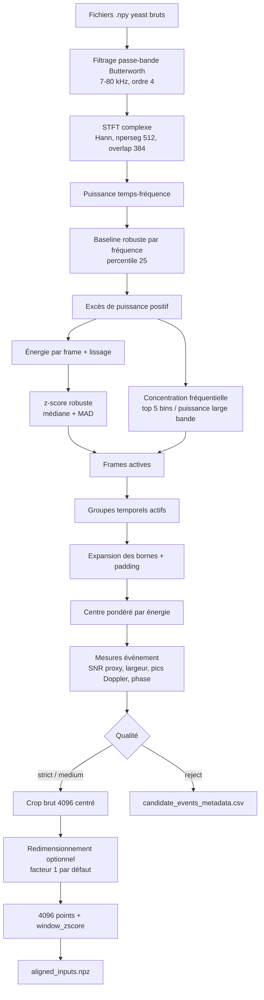
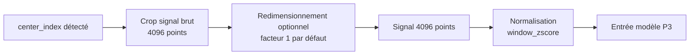

# Détection Des Événements Yeast Et Génération Du Dataset P3

> **État au 2026-07-15.** Les paramètres « par défaut » expliqués ci-dessous
> décrivent le détecteur historique, qui a échoué à la revue v5. La configuration
> `review-calibrated-v1` (`SNR >= 12`, gap `0.128 ms`, largeur maximale `2.0 ms`,
> cinq événements au maximum) a passé la revue manuelle v7 sur l'acquisition
> disponible. Le dataset `yeast-events-representation@v3` en est la sortie de
> référence, mais la fiabilité reviewer et la généralisation sur une seconde
> acquisition restent à établir. Voir le
> [rapport final](YEAST_SSL_REBUILT_STUDY_REPORT.md) et le
> [journal d'exécution](YEAST_SSL_EXECUTION_LOG.md#historical-gate-1-check).

Cette note décrit le pipeline implémenté dans
[`scripts/build_yeast_event_dataset.py`](../scripts/build_yeast_event_dataset.py).
Son rôle est de transformer des signaux `.npy` yeast bruts en événements centrés,
normalisés et compatibles avec les modèles P3, tout en gardant les métadonnées
nécessaires pour auditer la détection.

Le dataset canonique P3 4096 est généré ici par défaut :

```text
artifacts/unsupervised-learning-flow-cytometry/pretrained_backbones/yeast_passage_events_p3_4096/
```

La sortie modèle principale est `aligned_inputs.npz`. Elle contient des
fenêtres de 4096 points centrées sur un passage yeast détecté. Les anciens runs
peuvent encore contenir `aligned_512_inputs.npz`, mais ce nom correspond à la
compatibilité historique, pas à la représentation P3 canonique.

## Vue D'ensemble

Le pipeline ne détecte pas les passages uniquement avec un seuil sur le signal
temporel. Il utilise une détection temps-fréquence basée sur :

- un filtrage passe-bande Butterworth ;
- une STFT complexe avec fenêtre de Hann ;
- une baseline robuste par percentile et MAD robuste ;
- un score d'énergie temps-fréquence exprimé en z-score robuste ;
- une mesure de concentration fréquentielle ;
- un regroupement temporel des frames actives ;
- une extraction de pics Doppler, y compris les cas multi-pics ;
- un score de cohérence de phase ;
- des règles qualité `strict`, `medium` ou `reject`.



## Entrées

Par défaut, le script lit les fichiers `.npy` sous :

```text
/home/intern/Downloads/Yeast_folder
```

Les sous-dossiers servent de groupes source, par exemple `budding`, `mix`,
`shmoo` et `shmoo2`. Le script peut filtrer ces groupes avec `--include-groups`.

Chaque signal est traité indépendamment. Un même fichier peut produire plusieurs
passages, avec un maximum contrôlé par `--max-events-per-signal` ; la valeur par
défaut est `3`.

## Paramètres Principaux

Les valeurs ci-dessous correspondent aux valeurs par défaut dans
`YeastDetectionConfig`.

| Paramètre | Valeur | Rôle |
| --- | ---: | --- |
| `sampling_frequency_hz` | `2_000_000` | fréquence d'échantillonnage des signaux bruts |
| `low_freq_hz` | `7_000` | borne basse du passe-bande |
| `high_freq_hz` | `80_000` | borne haute du passe-bande |
| `filter_order` | `4` | ordre du filtre Butterworth |
| `stft_nperseg` | `512` | taille de fenêtre STFT |
| `stft_noverlap` | `384` | recouvrement STFT |
| `smooth_frames` | `3` | lissage de l'énergie par frame |
| `active_snr_z` | `3.5` | seuil z-score pour déclarer une frame active |
| `boundary_snr_z` | `1.5` | seuil plus bas pour étendre les bornes de l'événement |
| `cluster_gap_ms` | `0.25` | gap temporel max pour fusionner deux groupes actifs |
| `boundary_pad_ms` | `0.04` | padding ajouté autour des bornes détectées |
| `min_width_ms` | `0.06` | largeur minimale acceptée |
| `max_width_ms` | `1.60` | largeur maximale acceptée |
| `raw_crop_length` | `4096` | longueur du crop brut centré |
| `output_length` | `4096` | longueur finale envoyée aux modèles P3 |
| `class_id` | `3` | label numérique yeast |
| `class_name` | `yeast` | label texte |

## Étape 1 : Prétraitement Temporel

Le signal brut est d'abord ramené autour de zéro, puis filtré avec un filtre
passe-bande Butterworth entre `7 kHz` et `80 kHz`.

Technique utilisée :

- `scipy.signal.butter` pour construire le filtre ;
- `scipy.signal.filtfilt` pour appliquer un filtrage sans déphasage causal
  visible, car le filtre est appliqué en avant puis en arrière.

Ce filtrage isole la bande utile des passages yeast et réduit l'influence des
variations lentes ou du bruit hors bande.

## Étape 2 : Analyse Temps-Fréquence

Le signal filtré est transformé par spectrogramme complexe :

```python
spectrogram(..., window="hann", mode="complex")
```

On garde seulement les bins fréquentiels entre `low_freq_hz` et `high_freq_hz`.
Le script travaille ensuite sur la puissance :

```text
power = abs(STFT_complexe)^2
```

Cette représentation permet de détecter un passage même si son énergie est
principalement visible comme une structure fréquentielle locale, par exemple un
ou plusieurs pics Doppler.

## Étape 3 : Baseline Robuste Et Énergie Excédentaire

Pour chaque fréquence, le script estime une baseline avec le percentile 25 de la
puissance sur le temps. Ensuite, il garde seulement l'excès positif :

```text
excess(freq, frame) = max(power(freq, frame) - baseline(freq), 0)
```

L'énergie d'une frame est la somme de cet excès sur les fréquences. Cette énergie
est lissée sur `smooth_frames=3`, puis convertie en z-score robuste avec :

- médiane ;
- MAD robuste multiplié par `1.4826`.

Le nom `snr_proxy` vient de ce score : ce n'est pas un SNR physique calibré en dB,
mais un indicateur robuste de combien l'événement ressort du fond dans la
représentation temps-fréquence.

## Étape 4 : Concentration Fréquentielle

Une frame active doit aussi être concentrée fréquentiellement. Le script calcule :

```text
concentration_frame = puissance des 5 bins les plus forts / puissance large bande
```

L'objectif est de favoriser des passages qui forment une structure Doppler nette,
au lieu de garder uniquement des hausses d'énergie large bande.

Une frame est active si :

```text
energy_z >= active_snr_z
and concentration_frame >= medium_min_concentration
```

Avec les paramètres par défaut :

```text
energy_z >= 3.5
and concentration_frame >= 0.08
```

## Étape 5 : Regroupement Des Frames Actives

Les frames actives sont regroupées temporellement. Deux paquets actifs proches
peuvent être fusionnés si leur séparation est inférieure à `cluster_gap_ms`.
Ensuite, les bornes sont étendues tant que l'énergie reste au-dessus de
`boundary_snr_z`, puis un padding temporel de `boundary_pad_ms` est ajouté.

Le centre de l'événement n'est pas simplement le milieu des bornes. Il est
calculé comme un centre pondéré par l'énergie des frames :

```text
center = moyenne pondérée des centres de frames par max(frame_energy - baseline, 0)
```

Ce choix centre le crop sur la zone la plus informative du passage.

## Étape 6 : Pics Doppler Et Multi-Fréquences

Pour chaque événement candidat, le script somme l'excès de puissance sur les
frames de l'événement pour obtenir un profil fréquentiel. Il extrait ensuite les
pics avec `scipy.signal.find_peaks`.

Techniques utilisées :

- seuil de hauteur relatif : `frequency_peak_height_frac = 0.20` du pic max ;
- seuil de proéminence relatif : `frequency_peak_prominence_frac = 0.08` du pic max ;
- fallback sur le bin maximum si aucun pic n'est trouvé.

Les métadonnées enregistrées sont :

- `n_doppler_peaks` : nombre de pics détectés ;
- `doppler_low_hz` : plus basse fréquence parmi les pics ;
- `doppler_high_hz` : plus haute fréquence parmi les pics ;
- `doppler_peak_hz` : pic dominant.

C'est cette étape qui permet de représenter les cas avec double spike ou
structure multi-Doppler. Le filtre qualité ne force pas forcément deux pics ;
il les mesure et les enregistre.

## Étape 7 : Cohérence De Phase

La cohérence de phase est calculée directement sur la STFT complexe. Le script :

1. sélectionne jusqu'à trois pics fréquentiels ;
2. déroule la phase dans le temps avec `np.unwrap` ;
3. mesure la régularité des pas de phase par moyenne vectorielle complexe ;
4. ajoute, quand au moins deux pics sont disponibles, une cohérence de phase
   relative entre les deux pics principaux.

La valeur finale est stockée dans `phase_coherence`. Dans la configuration
actuelle, le seuil strict vaut `0.0`, donc cette métrique est surtout informative
et auditée, plutôt qu'un filtre sévère.

## Étape 8 : Classification Qualité

Chaque candidat devient `strict`, `medium` ou `reject`.

Un événement est rejeté si :

- sa largeur est inférieure à `min_width_ms` ;
- sa largeur est supérieure à `max_width_ms` ;
- le crop de 4096 points sortirait des bords du signal ;
- son score qualité est sous les seuils.

Un événement est `strict` si :

```text
snr_proxy >= 5.0
energy_concentration >= 0.12
phase_coherence >= strict_min_phase_coherence
```

Un événement est `medium` si :

```text
snr_proxy >= 3.0
energy_concentration >= 0.08
```

Le run observé utilise `quality_filter = strict`, donc seuls les événements
`strict` sont gardés dans `events_metadata.csv` et `aligned_inputs.npz`.

## Génération Des Entrées Modèle

Une fois l'événement gardé, le script construit l'entrée P3 canonique en 4096 points :



Cette étape est implémentée par `build_aligned_signal_at_center`.

Important : le crop est fait sur le signal brut, pas sur le signal filtré. Le
filtrage sert à détecter et localiser l'événement ; l'entrée modèle conserve la
forme brute centrée en 4096 points, puis la normalise.

La représentation finale est résumée dans `detection_summary.json` :

```text
center on detected yeast passage -> crop raw 4096 -> 4096 -> window_zscore
```

## Fichiers Produits

| Fichier | Contenu |
| --- | --- |
| `aligned_inputs.npz` | signaux `signals`, labels, split, event_id, centre et chemin source |
| `events_metadata.csv` | événements gardés après filtre qualité |
| `candidate_events_metadata.csv` | tous les candidats, y compris les rejets |
| `visual_events_metadata.csv` | sous-ensemble équilibré pour visualisation |
| `file_detection_report.csv` | résumé par fichier source |
| `detection_summary.json` | configuration, quantiles et compteurs globaux |
| `yeast_event_audit.pdf` | audit visuel des passages détectés |

## Colonnes Importantes Des Métadonnées

| Colonne | Signification |
| --- | --- |
| `event_id` | identifiant unique de l'événement |
| `sample_id` | identifiant dérivé du fichier source et de l'indice local |
| `signal_path` | chemin du `.npy` source |
| `center_index` | centre détecté dans le signal brut |
| `event_start`, `event_end` | bornes estimées de l'événement |
| `crop_start`, `crop_end` | bornes du crop brut 4096 |
| `width_ms` | durée estimée de l'événement |
| `snr_proxy` | z-score robuste max de l'énergie temps-fréquence |
| `energy_concentration` | concentration de puissance dans les bins fréquentiels dominants |
| `phase_coherence` | cohérence de phase STFT |
| `n_doppler_peaks` | nombre de pics fréquentiels détectés |
| `doppler_low_hz` | fréquence basse parmi les pics |
| `doppler_high_hz` | fréquence haute parmi les pics |
| `doppler_peak_hz` | fréquence du pic dominant |
| `quality` | `strict`, `medium` ou `reject` |
| `rejection_reason` | raison du rejet si applicable |

## Statistiques Du Run Observé

Pour le run canonique 4096 du 1er juillet 2026,
`artifacts/unsupervised-learning-flow-cytometry/pretrained_backbones-4096_20260701/yeast_passage_events_p3_4096/`,
le résumé indique :

| Quantité | Valeur |
| --- | ---: |
| fichiers scannés | `6172` |
| fichiers avec candidats | `6171` |
| fichiers avec événements gardés | `5108` |
| candidats totaux | `11962` |
| événements strict gardés | `7585` |
| filtre qualité | `strict` |

Répartition des événements gardés par groupe source :

| Groupe | Événements gardés |
| --- | ---: |
| `budding` | `923` |
| `mix` | `5452` |
| `shmoo` | `99` |
| `shmoo2` | `1111` |

Quantiles utiles des événements gardés :

| Mesure | p05 | p25 | p50 | p75 | p95 |
| --- | ---: | ---: | ---: | ---: | ---: |
| `width_ms` | `0.528` | `0.656` | `0.912` | `1.104` | `1.424` |
| `snr_proxy` | `6.53` | `19.09` | `95.29` | `274.31` | `789.46` |
| `energy_concentration` | `0.826` | `0.916` | `0.955` | `0.975` | `0.987` |
| `phase_coherence` | `0.496` | `0.664` | `0.783` | `0.912` | `0.993` |

## Audit Visuel

Le PDF `yeast_event_audit.pdf` montre, pour un sous-ensemble d'événements :

1. le signal brut avec les bornes événement, centre et crop ;
2. le crop brut autour du passage ;
3. l'entrée finale 4096 points utilisée par les modèles P3 canoniques.

Ce fichier sert à vérifier que les centres détectés tombent bien sur les passages
et que la fenêtre finale contient l'information utile.

## Commande De Reproduction

La commande de base est :

```bash
../.venv/bin/python scripts/build_yeast_event_dataset.py \
  --input-dir /home/intern/Downloads/Yeast_folder \
  --output-dir artifacts/unsupervised-learning-flow-cytometry/pretrained_backbones/yeast_passage_events_p3_4096 \
  --quality strict \
  --write-audit
```

Le chemin de sortie par défaut du script, si `--output-dir` n'est pas donné, est :

```text
artifacts/unsupervised-learning-flow-cytometry/pretrained_backbones/yeast_passage_events_p3_4096
```

## Tests Associés

Les tests liés à ce pipeline sont dans
[`tests/test_yeast_event_dataset.py`](../tests/test_yeast_event_dataset.py).
Ils couvrent notamment :

- la détection d'un passage synthétique multi-Doppler ;
- la présence de plusieurs pics Doppler ;
- la construction d'une fenêtre finale 4096 points normalisée ;
- l'écriture des fichiers P3 compatibles.

Commande ciblée :

```bash
../.venv/bin/python -m pytest tests/test_yeast_event_dataset.py
```

## Points D'attention

- `snr_proxy` n'est pas un SNR physique en dB ; c'est un z-score robuste de
  l'énergie temps-fréquence.
- Les événements proches des bords sont rejetés si le crop brut 4096 sortirait
  du signal.
- Les doubles pics fréquentiels sont mesurés par `n_doppler_peaks`,
  `doppler_low_hz` et `doppler_high_hz`, mais le mode `strict` actuel ne demande
  pas explicitement deux pics.
- La localisation est calculée dans l'espace temps-fréquence filtré, puis le
  modèle reçoit un crop du signal brut centré sur cette localisation.
- Le choix `quality=strict` favorise la propreté des exemples au prix de rejeter
  certains passages ambigus ou trop proches des bords.
